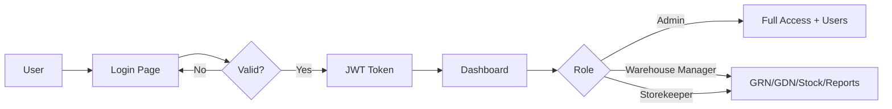
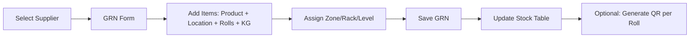
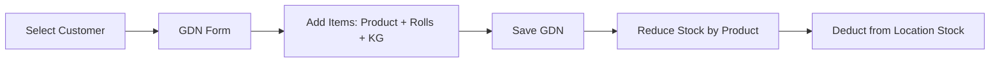
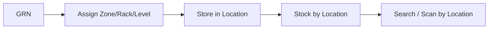
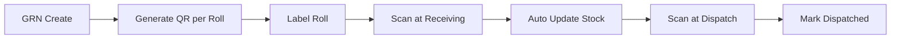
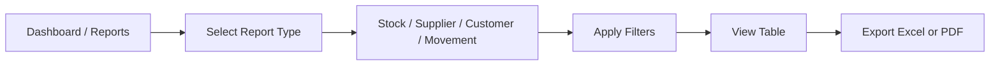
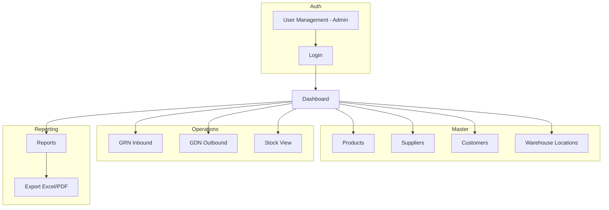

# JNT Suppliers WMS – Workflow Diagrams

## 1. Login & Authentication

## 2. GRN (Inbound) Workflow

**Steps:**
1. Select supplier
2. Add line items: product, warehouse location (Zone/Rack/Level), rolls, kg
3. Save → backend creates GRN and upserts `stock` (product_id + location_id)
4. Optional: generate barcode/QR label per roll at GRN creation

## 3. GDN (Outbound) Workflow

**Steps:**
1. Select customer
2. Add line items: product, rolls, kg
3. Save → backend creates GDN and deducts from `stock` (FIFO by location rows)

## 4. Warehouse Location System

- Each GRN line stores product + location + rolls + kg
- Stock is queryable by product (summary) or by location (Zone/Rack/Level)
- Barcode/QR scan can resolve to roll → product + location

## 5. Barcode / QR Flow

- **Generate:** `GET /api/barcode/label/:rollId` or `GET /api/barcode/qr/:data` for QR image
- **Scan:** `POST /api/barcode/scan` with `{ barcode, action? }` returns roll details; optional `action: 'dispatch'` marks roll dispatched

## 6. Reports Flow

- **Stock:** by product or by location
- **Supplier:** GRN history (optional filter by supplier_id)
- **Customer:** GDN history (optional filter by customer_id)
- **Movement:** GRN + GDN combined (date range)
- **Fast Moving:** products by dispatch volume (last N days)
- Export: Excel (XLSX) and PDF (stock report)

## 7. High-Level Module Map

---

All workflows are implemented in the API and UI. Use these diagrams as reference for training or integration.
